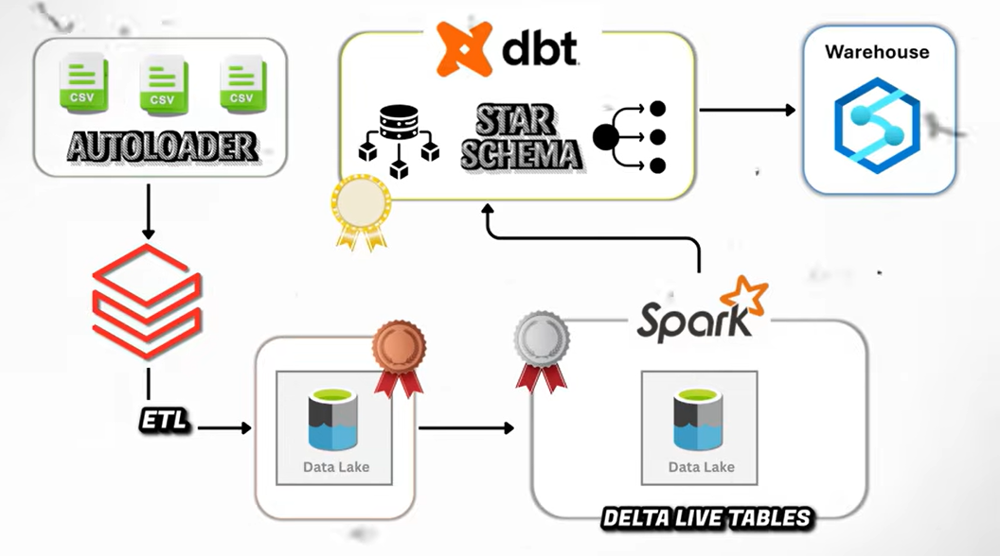

# End-to-End Databricks Lakehouse Flight Pipeline ✈️

A complete data engineering pipeline built on the Databricks Lakehouse, demonstrating real-world ingestion and transformation techniques using PySpark, Autoloader, Delta Live Tables, and SCD logic.

---

## 📌 Features

- Incremental ingestion with Databricks Autoloader
- Structured Streaming for new flight/booking data
- Bronze → Silver → Gold Medallion Architecture
- Delta Live Tables (DLT) for declarative pipelines
- Automated Slowly Changing Dimensions (SCD Type 2)
- Creation of fact and dimension tables for analytics
- Unity Catalog organization

---

## 📂 Project Structure

- `data/`       : Raw + incremental datasets  
- `notebooks/`  : Databricks notebook (.dbc)  
- `images/`     : Architecture diagram

---

## 🧱 Architecture

---

## 🚀 How to Run

1. Import the `.dbc` notebook into Databricks  
2. Upload CSVs into a UC volume  
3. Configure Autoloader paths  
4. Run Bronze → Silver → Gold logic  
5. Execute DLT pipeline  
6. Validate fact/dim outputs  

---

## 🔧 Tech Stack

- Databricks  
- PySpark  
- Delta Lake  
- Autoloader  
- Delta Live Tables  
- Unity Catalog
